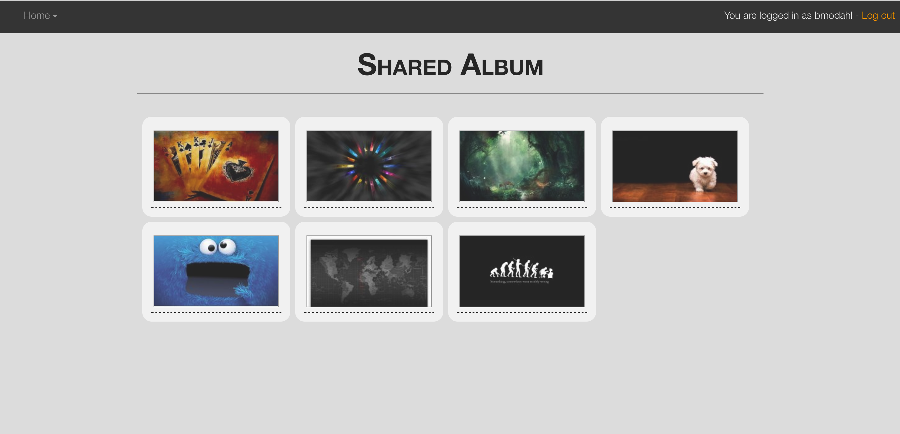

# UnsocialPhotoShare

# Brandon Modahl's Individual Project

### Problem Statement

The idea for this project came to me because my Dad is not a user of social media, and doesn't use sites like Facebook or Instagram, yet still shares photos with friends and family.

Even though there are other resources that could be used for this, I'm also doing it out of interest. Originally I implemented this idea for a previous PHP project, but am now changing over to a Java environment and implementing new features and functions.

My overall goal for this project is to end up with a shared media application with the social aspect involved.

#### Original Project...

### Project Technologies/Techniques

* Security/Authentication
  * User role: Upload, Access, View Others Images
  * All: View Images you are associated with
  * Follow/Followers, notifications
* Database (MySQL and Ebean)
  * Store users and roles
  * Store Image reference
* Web Services or APIs
  * Still considering choices...
* Bootstrap
* Logging
  * Configurable logging using Log4J. In production, only errors will normally be logged, but logging at a debug level can be turned on to facilitate trouble-shooting.
* Site and database hosted on AWS
* Unit Testing
  * JUnit tests to achieve 80% code coverage
* Independent Research Topic
  * Play framework

### Design

* [Screen Design](screens.md)
* [Database Design](dbdesign.md)

### [Project Plan](ProjectPlan.md)

### [Time Log](TimeLog.md)
